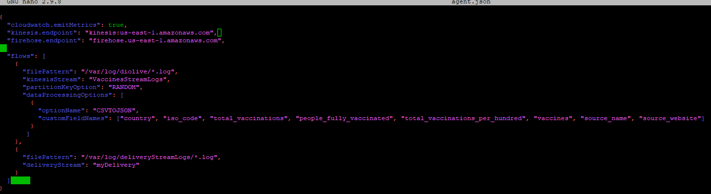

# Covid Vaccinations Data Analytics using Amazon Kinesis and Glue Data Brew
This is a modified exercise from DIO AWS DevOps Bootcamps


### First I created a new Kinesis Delivery Stream:
- AWS Console -> Kinesis -> Create Firehose Delivery Stream: "StreamName" -> Direct PUT -> Next -> Choose Destination -> Create S3 Bucket: "BucketName"  -> Configure settings -> buffer size 5mb -> buffer interval 60s -> IAM Role -> create new role -> Review and create

### Created a new EC2 VM to run the scripts of the LogGenerator and execute AWS Kinesis Agent
- AWS Console -> EC2 -> Amazon Linux 2 AMI -> t2micro -> review and launch -> create new key pair -> download .pem file -> download putty -> puttygen -> load.pem file -> save .ppk file -> putty copy dns -> paste hostname -> SSH -> auth -> load ppk file -> login “ec2-user”

**Commands:**
```yaml
- _sudo yum install -y aws-kinesis-agent_
  - _sudo yum install -y git_
  - _git clone https://github.com/cassianobrexbit/dio-live-aws-bigdata-2.git_
  - _unzip Dataset.zip_
  - _chmod a+x LogGenerator.py_
  - _nano LogGenerator.py_
  - _less country_vaccinations.csv_
  - _sudo mkdir /var/log/diolive_
  - _cd /etc/aws-kinesis_
  - _sudo nano agent.json_
``` 

**   Update contents inside agent.json. Like the region of our kinesis instance, edit the flows and specify the fields inside the input CSV **
`  - agent.json -> "kinesis.endpoint": "kinesis.<region>.amazonaws.com"`


** Created a new IAM Role for my EC2:** 
- AWS Console -> EC2 -> Instances -> Select Instance -> Security -> Modify IAM Role -> Create New Role -> EC2 -> Administrator Access -> rolename “ec2-admin-role” -> save
**Commands:**
 ```yaml
- _sudo service aws-kinesis-agent start_
  - _sudo chkconfig aws-kinesis-agent on_ (start with instance)
  - _cd ~_
  - _sudo ./LogGenerator.py <quantity of registries>_
  - _tail -f /var/log/aws-kinesis-agent/aws-kinesis-agent.log_
```
#### Finally our data streams were saved into the bucket. We can check this  in the AWS console and download. It can be opened with notepad.
#### Now when we download the data from the S3 Bucket that received the Data Stream, we will see the log, but it's not in a good shape, need to be treated so que can examine and monitor it better. For this, we will use AWS Glue Data Brew


### AWS Glue
- AWS Console -> glue databrew -> create new project -> create new role -> create project
- Create dataset -> select the registry from our S3 bucket -> CSV

#### Now we can see much better. The entire information from our Data Streams. But adding some steps to the Recipe can improve it even more. So I rename the Colummn names.

 
