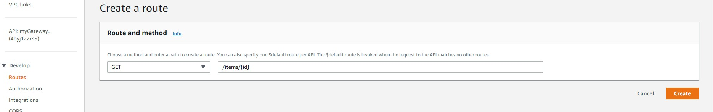
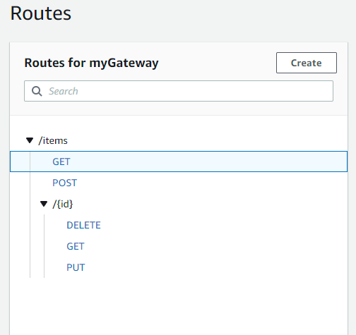
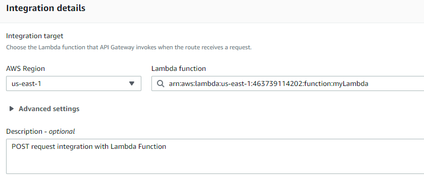

# REST API using AWS API Gateway and DynamoDB

This is just an example of how to use DynamoDB trough JS script. 

### Create your table in AWS DynamoDB
- DynamoDB -> Create Table -> set PK -> Explore Table Items -> Create Items 

### Create a new Lambda Function and write the scripts
- Lambda -> Create a Function -> Edit your code(in this case JS script) -> Create policy to execute Lambda Functions(DynamoDB Full Access) -> Deploy 
The Lambda will act like the route controller for the REST routes (GET,POST,PUT,DELETE)

### Create a new API Gateway and te API Routes
- API Gateway -> HTTP type -> Build -> Create 
- API Gateway (Develop section) -> Routes -> Create

Once you have all the routes you want, you will see the tree like this 

### Integrate your API Gateway routes with the Lambda Function
- API Gateway (Develop section) -> Integration -> Select the route -> Create and attach an Integrtion -> Lambda type -> Select Lambda ARN -> Create

